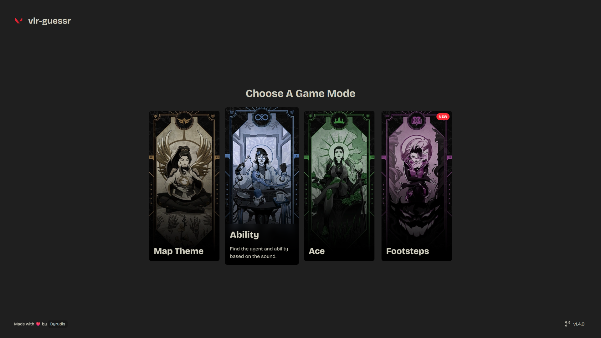
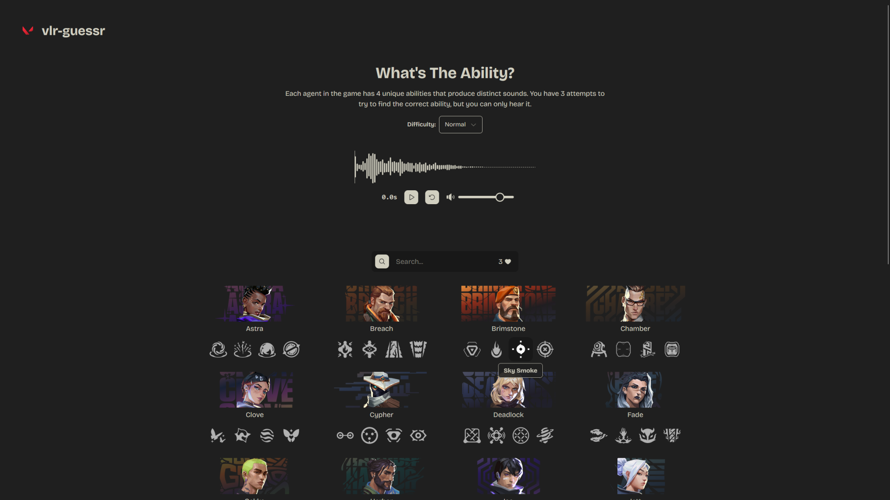

# vlr-guessr


**vlr-guessr** is a web game where players can test their knowledge of Valorant SFX. The game challenges users to identify maps, agent/abilities and skin bundles based on the audio. You can access the production version of the website [here](https://vlr-guessr.pages.dev/).

## Screenshots




## Table of Contents

- [Installation](#installation)
- [Usage](#usage)
- [Development](#development)
- [Contributing](#contributing)
- [Acknowledgments](#acknowledgments)

## Installation

To run this project locally, follow these steps:

1. Clone the repository:

```bash
git clone https://github.com/dyrudis/vlr-guessr.git
cd vlr-guessr
```

2. Install dependencies:

```bash
npm install
```

3. Start the development server:

```bash
npm run dev
```

4. Open your browser and navigate to:

```plaintext
http://localhost:5173
```

## Usage

1. Choose a game mode from the main menu.
2. Listen to the sound (ace or theme) and try to identify the correct skin bundle or map.
3. Use the search bar to filter by name.
4. Click on any card to make your guess.
5. Win or lose, try again and improve your score!

## Development

Prerequisites

- Node.js (v22.13.1 or higher)
- npm (v9.0.0 or higher)

Scripts

- Start Development Server: `npm run dev`
- Build for Production: `npm run build`
- Lint Code: `npm run lint`
- Preview Production Build: `npm run preview`

## Contributing

Contributions are welcome! If you have suggestions for improvements or new features, please [open an issue](https://github.com/Dyrudis/vlr-guessr/issues/new).

## Acknowledgments

- **Valorant API**: For providing the skin bundle data.
- **Phosphor Icons**: For the sleek and modern icons.

Enjoy playing **vlr-guessr**! 🎮
